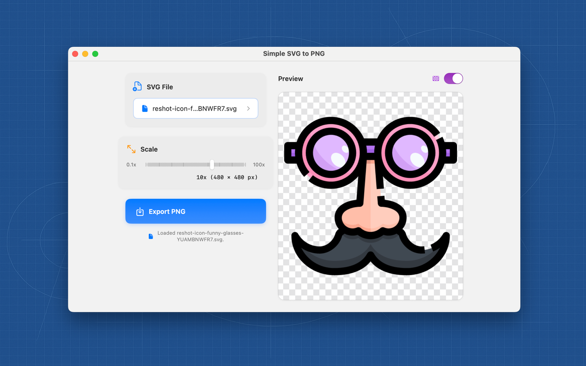

# Simple SVG to PNG

Fast, accurate SVG → PNG conversion for macOS. Adjustable scale, instant preview, and a distraction-free UI.

> Available on the Mac App Store: **Coming Soon!**

---

## Highlights
- **Drag & Drop or Browse**: Open any `.svg`
- **Live Preview**: Checkerboard or neutral gray background
- **Scale Control**: Set a factor and see exact output dimensions
- **Crisp Output**: Preserves transparency
- **Private by Design**: Runs fully on your Mac (no network)

---

## Screenshot

---

## Requirements
- macOS 12 or later

---

## Usage
1. Launch **Simple SVG to PNG**.
2. Open an SVG (button or drag & drop).
3. Adjust **Scale**. The label shows the final **W × H** in pixels.
4. Choose **Checkerboard** or **Gray** preview background.
5. Click **Export PNG…** and pick a destination (defaults to Downloads).

---

## FAQ

**Does it change colors or flatten vectors oddly?**  
No. Output is a faithful PNG of your SVG, including transparency.

**Does it require internet?**  
No. Everything runs locally on your Mac.

**Batch export?**  
Not yet. If you need it, please upvote the feature request.

---

## Support
- Open an issue here on GitHub

When reporting an issue, please include:
- A sample SVG (if possible)
- macOS + app version
- Steps to reproduce

---

## Privacy
- No analytics, no tracking, no network calls.
- Files are processed locally and never leave your device.

---

## Roadmap
- Batch conversion (folder)
- Width/Height targeting (in pixels) in addition to scale
- Recent files and quick actions

---

## Acknowledgments
- Uses the excellent **resvg** renderer under the hood.  
  Project: https://github.com/RazrFalcon/resvg

---

## License
All rights reserved.  
If you’re interested in contributing, feel free to open a pull request.

---

## Changelog
**1.0** — Initial release.
